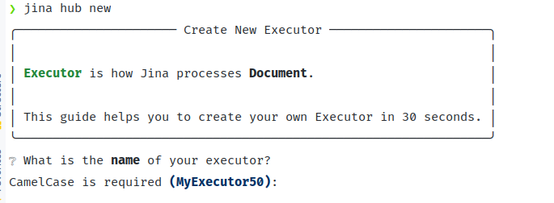

> 🧭 To develop your own Executor, please use [`jina hub new`](#create-new) and create your own Executor repo.

# Jina Executors

This repository provides a selection of [Executors](https://github.com/jina-ai/jina/blob/master/.github/2.0/cookbooks/Executor.md) for [Jina](https://github.com/jina-ai/jina).

**⚙️ Executor is how Jina processes Documents.** It is the building block of your Jina data pipeline, providing a specific functional needs: preparing data, encoding it with your model, storing, searching, and more.


## Usage

The following is general guidelines. Check each executor's README for details.

### JinaHub

Each of these Executors are available on our Jinahub distribution platform. They are automatically published on every new change. This is the recommended usage:

#### via Docker image

Use the prebuilt image from JinaHub in your Python code 

```python
from jina import Flow
	
f = Flow().add(uses='jinahub+docker://ExecutorName')
```

#### via source code

Use the source code from JinaHub in your Python code:

```python
from jina import Flow
	
f = Flow().add(uses='jinahub://ExecutorName')
```

<details>
<summary>Click here to see advanced usage</summary>
	

This is only for internal usage (Jina AI engineers).

### Via Pypi

1. Install the `executors` package.

	```bash
	pip install git+https://github.com/jina-ai/executors/
	```

1. Use `executors` in your code

   ```python
   from jina import Flow
   from jinahub.type.subtype.ExecutorName import ExecutorName
   
   f = Flow().add(uses=ExecutorName)
   ```


### Via Docker

1. Clone the repo and build the docker image

	```shell
	git clone https://github.com/jina-ai/executors
	cd executors/type/subtype
	docker build -t executor-image .
	```

1. Use `executor-image` in your code

	```python
	from jina import Flow
	
	f = Flow().add(uses='docker://executor-image:latest')
	```

</details>

## Create new

> ⚠️ Please do **not** commit your new Executor to this repository. This repository is **only** for Jina engineers to better manage in-house executors in a centralized way. You *may* submit PRs to fix bugs/add features to the existing ones.

Use `jina hub new` to create a new Executor, following easy interactive prompts:



Then follow the guide on [Executors](https://github.com/jina-ai/jina/blob/master/.github/2.0/cookbooks/Executor.md) and how to [push](https://github.com/jina-ai/jina/blob/master/.github/2.0/cookbooks/Hubble.md) it to the Jina Hub marketplace.
	
## Contributing

While this repository is primarily developed and maintained by the Jina engineering team, we welcome contributions from the community as well!

For instructions on how to contribute, please check out the [CONTRIBUTING.md](./CONTRIBUTING.md) guilde.

## Using this repository as a package

Notice that we have a `setup.py` in this repository. 
This is **NOT recommended** practice for **external developers** of Executors. 
We added this in order to ease local development for **internal developers**.

This file, along with the `__init__.py`s in each of the folders, do not matter when using the Executors via the `jinahub://` syntax, [above](#jinahub).

## CompoundExecutors

If you want to develop a `CompoundExecutor`-type Executor based on one of the classes provided in this package, you can either:

- fork this repo and add it as a separate folder. Start with `jina hub new`, and then follow the design patterns we have established in [here](jinahub/indexers/searcher/compound) and in the [docs](https://github.com/jina-ai/jina/blob/master/.github/2.0/cookbooks/Executor.md).
- copy-paste the class you want to have a component of your `CompoundExecutor`, and add it as a class in your Executor's package

